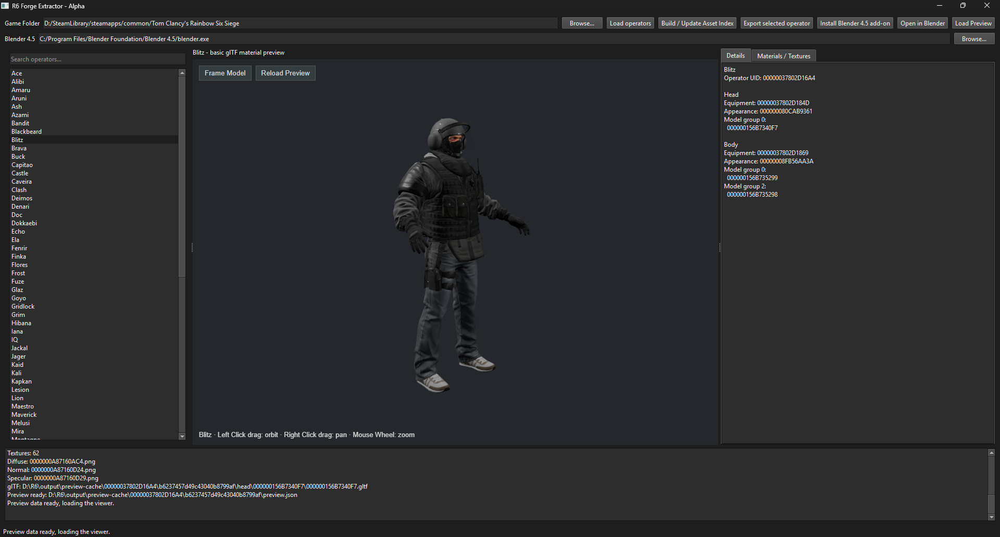

# Rainbow Six Siege Forge Extractor

A Windows tool for browsing Rainbow Six Siege operators and exporting them to Blender.

Includes operator search, asset indexing, export, Blender 4.5 add-on installation and direct Blender launch.



*Published alpha interface shown. The source build now includes an interactive 3D preview with material selection and texture inspection.*

[](https://github.com/TrueShadow01/R6-Extractor/releases)
[](https://github.com/TrueShadow01/R6-Extractor/releases)
[](LICENSE)

## Standalone setup

Requires 64-bit Windows, a local Siege installation, a compatible Oodle runtime ([such as this one](https://drive.google.com/file/d/1Q2Bhz1jmjBFRBzsN0eS1UDMsqgDCpdXl/view?usp=sharing)) and Blender 4.5. Python is not required for the standalone build.

1. Extract the entire release ZIP into a folder.
2. Keep `R6ForgeExtractor.exe`, `R6Worker.exe` and `_internal` together.
3. Configure Oodle as described below.
4. Launch **R6ForgeExtractor.exe**.
5. Choose your game folder and Blender 4.5 executable using **Browse**.

### Oodle

Supply a compatible `oo2core_*_win64.dll` you are authorized to use. Some games using Oodle include this DLL in their installation folders, you may already have a suitable copy in a game you own. Compatibility is not guaranteed.

Place the DLL beside `R6ForgeExtractor.exe`, or set `R6_OODLE_DLL` to its full path.

For example, launch from PowerShell:

```powershell
$env:R6_OODLE_DLL = "C:\Path\To\oo2core_8_win64.dll"
.\R6ForgeExtractor.exe
```

Oodle is not bundled. See [RAD's official Oodle page](https://www.radgametools.com/oodle.htm) for product information and evaluation requests.

## Export and open an operator

1. Click **Build / Update Asset Index**. Repeat after game updates.
2. Click **Load operators**, then search for and select an operator.
3. Click **Export selected operator** and choose a destination.
4. Close Blender and click **Install Blender 4.5 add-on** once or again after updating the importer.
5. Click **Open in Blender** while selecting the exported operator.

Exports use:

```text
<destination>/<operator-name>/<body-or-head>/<model-UID>/
```

The UI remembers paths and successful exports across restarts. Moving or deleting exported files invalidates their saved paths.

Export attempts every primary group-0 model and excludes alternate groups. It stops on the first failure and retains completed files. Closing the UI waits for the active indexing, export or installation operation to finish.

The asset database is stored in `output/r6-assets.sqlite` beside the executables. Registry browsing does not require the database.

## Blender import

The add-on imports geometry and applies the existing material fixes. Ordinary glTF import does not apply the helper's shaders.

To import an existing export manually, use **File → Import → Rainbow Six Siege Operator** in Blender. Select the operator folder containing `body` and `head`.

Blender 4.5 is required by this alpha. The UI confirms that Blender launched, import errors appear in Blender's system console.

## Known limitations

- Registry discovery was checked against an installation containing 78 operators. Game updates may require parser changes
- Caveira and Ace received visual checks. Alibi's clothing/material colors and Solis's source-selected gold lens received targeted checks. Full operator fidelity remains unverified.
- Export supports LOD0 glTF. Complete skeleton hierarchy, animations and GLB export are unavailable
- Shaders approximate the game appearance. Streamed textures and several material effects remain incomplete
- The source build includes an interactive cached preview with eye reconstruction, clothing tints and packed metalness/glossiness. Standalone preview packaging remains unverified
- Visor transparency and several shader effects remain incomplete. Preview lighting approximates a studio, not the game's lighting
- Cancellation and batch export resume are not available yet

## Running from source

Requires 64-bit Python 3.10 or newer. Run from the project directory:

```powershell
py -3 -m pip install -r requirements-gui.txt
py -3 -B app.py
```

For source execution, place Oodle beside `main.py` or use `R6_OODLE_DLL`.

### Preview development

Click **Load Preview** to prepare and view the selected operator. The preview includes studio environment reflections.

Shift-click a surface to capture the layers beneath the cursor and open **Materials / Textures**. Choose a layer from the dropdown to update its outline, material, shader UIDs, exported parameters, texture filenames, dimensions and thumbnails. Shift-click elsewhere to capture a new list or empty space to clear it.

Selection follows mesh geometry rather than texture-alpha pixels. The layer dropdown includes intersected zero-opacity overlays. Selected edges remain visible through other surfaces. Selection does not change material opacity.

**Reload Preview** reloads viewer code and cached model files while preserving the camera. Source builds also reload automatically after top-level JavaScript, HTML or CSS files in `viewer` stop changing for about one second.

Viewer-only changes do not require another export. Geometry is reloaded from the cache. It does not stay resident across reloads. Python changes require restarting the app and extraction changes may require regenerating cached data.

If a code error prevents automatic reload, fix it and click **Load Preview** again.

The CLI also supports archive scanning, resumable raw extraction, catalogs and model discovery:

```powershell
py -3 -B main.py -h
py -3 -B -m unittest discover -s tests -v
```

The standalone CLI is available through:

```powershell
.\R6Worker.exe --worker cli -h
```

Tests use synthetic data and do not require game assets or Oodle.

## Next steps

1. Remaining visor effects and broader material validation
2. Improved preview error recovery and material debugging tools
3. Standalone preview packaging, cancellation and resumable batch exports

## License and third-party assets

See [LICENSE](LICENSE) for the project license. Bundled dependencies retain their respective licenses.

Rainbow Six Siege and its assets belong to Ubisoft. Game assets and the proprietary Oodle runtime are not included or covered by this project's license.

See [THIRD_PARTY.md](THIRD_PARTY.md) for bundled dependency notices and source locations.